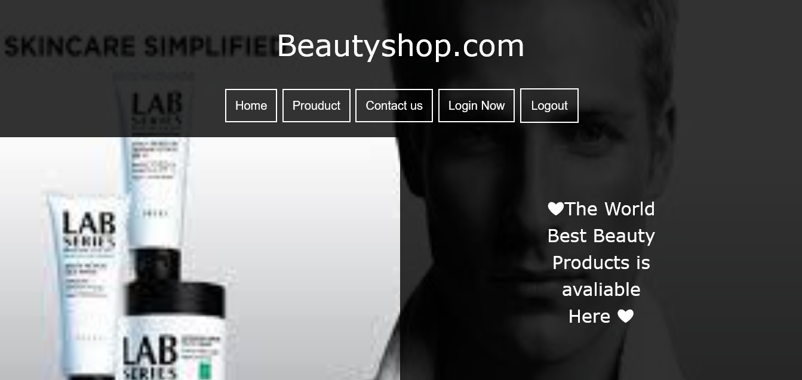

# BeautyShop Website

A modern and fully responsive **BeautyShop Website** built using **HTML5, CSS3, and Bootstrap**. The website is designed as a complete frontend beauty shopping experience with multiple pages, responsive layouts, and separate navigation menus for desktop and mobile users.

## Features

* Fully responsive design
* Home page
* Login page
* Sign Up page
* Products page
* Contact page
* Separate menu/navigation for desktop
* Separate menu/navigation for mobile
* Responsive product layout
* Clean and modern beauty-shop design
* Bootstrap responsive grid and components
* Custom CSS styling
* Mobile, tablet, and desktop support

## Pages

### Home Page

The home page introduces the BeautyShop website with an attractive landing-page design and navigation to the main sections of the website.

### Login Page

A dedicated login page where users can enter their account credentials.

### Sign Up Page

A registration page designed for new users to create an account.

### Products Page

A product showcase page displaying beauty products in an organized and responsive layout.

### Contact Page

A contact page that allows visitors to find contact information and get in touch with the website.

## Technologies Used

* **HTML5** – Website structure and page content
* **CSS3** – Custom styling, layouts, and responsive design
* **Bootstrap** – Responsive grid system and UI components

## Responsive Design

The website is designed to work smoothly on:

* Desktop
* Laptop
* Tablet
* Mobile

A **desktop navigation menu** and a **separate mobile navigation menu** were created to provide a better user experience on different screen sizes.

## Screenshots

You can add your website screenshots to the repository and display them in this section.

```markdown



```

## How to Add Screenshots

Rename your screenshots:

```text
screenshot1.png
screenshot2.png
screenshot3.png
screenshot4.png
```

Place them in the same folder as your `README.md`.

Example project structure:

```text
BeautyShop/
│
├── index.html
├── login.html
├── signup.html
├── products.html
├── contact.html
├── style.css
├── images/
│   ├── product1.jpg
│   ├── product2.jpg
│   └── ...
├── screenshot1.png
├── screenshot2.png
├── screenshot3.png
├── screenshot4.png
└── README.md
```

## How to Run

1. Download or clone this repository.
2. Open the project folder.
3. Open `index.html` in your web browser.
4. Navigate through the Home, Products, Login, Sign Up, and Contact pages.

No server is required for the frontend version of this project.

## Purpose of the Project

This project was created to practice frontend web development and build a complete multi-page business website.

Through this project, I practiced:

* HTML5 page structure
* CSS3 styling
* Bootstrap
* Responsive web design
* Multi-page website development
* Responsive navigation
* Creating separate desktop and mobile menus
* Designing product pages
* Creating login and registration interfaces


## Author

**Sammir Ahmad**

Frontend Web Development Student
